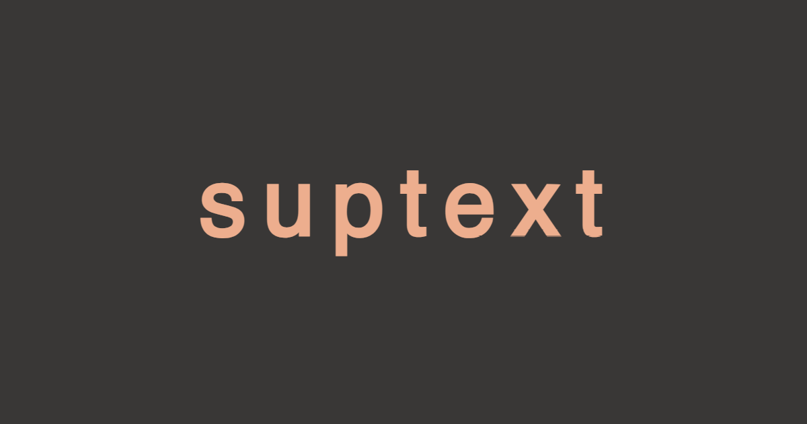
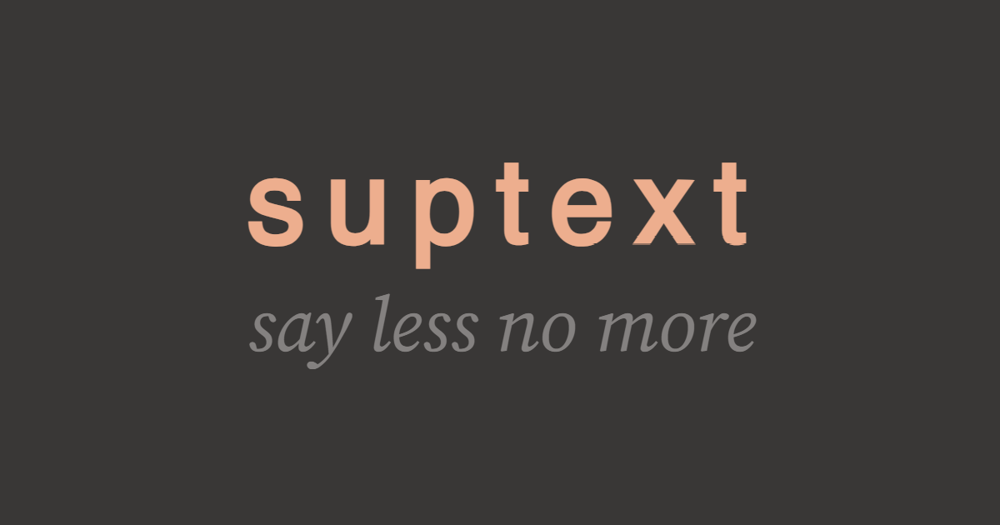

  

    <a rel="next" href="./more/2024/07/22/failing-in-the-open">
      <h2>We need more failure</h2>
      <h3>How to mend massively broken systems</h3>
    </a>
  

  

    <a rel="next" href="./past/2024/03/15/talking-heaps">
      <h2>Scraping the barrel</h2>
      <h3>Getting research data from heap snapshots</h3>
    </a>
  

  
  

    <a rel="next" href="./past/2024/02/28/whose-stack-is-it-anyway">
      <h2>Whose stack is it anyway?</h2>
      <h3>A technical guessing game</h3>
    </a>
  

